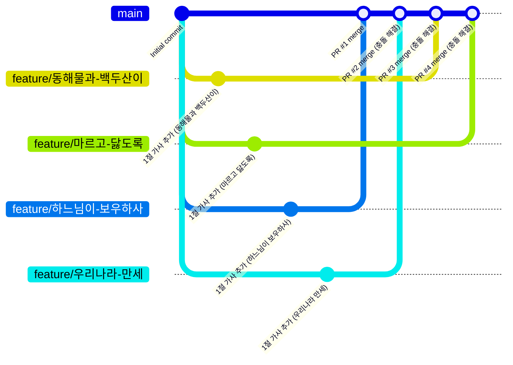

# 🇰🇷 Aegukga Project (애국가 프로젝트)

> **Aegukga Project**는 팀원 4명이 각자의 feature 브랜치에서 같은 파일의 같은 위치를 수정하고, Pull Request로 main에 병합하는 과정에서 Git 충돌(Merge Conflict)을 일부러 만들어보고 직접 해결하는 실습입니다. 애국가 1절 가사를 한 소절씩 나눠 맡아 코드를 완성해보세요!


## 1. 프로젝트 소개

이 프로젝트는 `System.out.println`으로 애국가 1절을 한 줄씩 출력하는 아주 단순한 Java 프로그램입니다. 코드 자체는 어렵지 않지만, **네 사람이 각자의 브랜치에서 같은 지점을 고치고, Pull Request로 main에 합치면서 충돌 → 해결 → 재push → merge의 흐름을 몸으로 익히는 것**이 이 실습의 진짜 목적입니다.

이번 실습에서는 각자 자신만의 **feature 브랜치**를 만들어 독립적으로 작업하지만, 저장소 자체는 팀 전체가 공유하는 **하나의 원격 저장소**를 함께 사용합니다. (나중에 진행할 가산 맛집 프로젝트에서는 아예 저장소 자체를 각자 Fork해서 작업하게 되는데, 그것과 달리 이번에는 저장소는 하나를 공유하되 브랜치만 나눠서 작업합니다.) 그리고 각자의 feature 브랜치를 Pull Request로 main에 병합하는 과정에서, 여러 사람이 같은 위치를 고쳤을 때 발생하는 merge 충돌을 자연스럽게 경험하게 됩니다.


## 2. 실습 목표

- `git init` → `git add` → `git commit` → `git push`로 새 프로젝트를 원격 저장소에 올리는 흐름 복습 (팀장)
- `git clone`으로 같은 저장소를 여러 명이 함께 사용하는 방법 익히기
- `git checkout -b`로 feature 브랜치를 만들어 서로 방해받지 않고 독립적으로 작업하는 방법 익히기
- GitHub에서 Pull Request를 생성하고, 팀원의 PR을 리뷰·Approve하는 협업 과정 경험하기
- **동일한 파일의 동일한 위치**를 여러 명이 각자의 브랜치에서 수정했을 때, PR을 main에 merge하는 과정에서 발생하는 merge conflict 경험하기
- 충돌 마커(`<<<<<<<`, `=======`, `>>>>>>>`)를 직접 읽고, 내용을 이해한 뒤 수동으로 해결하기
- 충돌 해결 후 다시 push하여 PR을 merge하고, 나머지 팀원들도 최신 main을 pull하며 동기화하기

> 💻 이 실습은 꼭 CLI(터미널)로만 진행할 필요 없습니다. IntelliJ 안의 터미널을 열어 지금까지처럼 명령어를 직접 입력해도 되고, IntelliJ 좌측/상단의 Git GUI(Commit 창, Push/Pull 버튼, 브랜치 메뉴 등)를 클릭해서 진행해도 됩니다. GUI에서 버튼을 눌러도 그 뒤에서는 결국 우리가 배운 것과 똑같은 git 명령어가 실행되고 있을 뿐입니다. 특히, **변경 사항을 비교(이를 diff라고 함)**하거나 충돌을 해결할 때는 GUI의 코드 에디터 기반 비교 화면을 쓰면 훨씬 편하니, 이번 기회에 CLI와 GUI를 자유롭게 오가며 둘 다 경험해보세요.


## 3. Sing.java 살펴보기

팀장이 사용할 시작 코드는 아래와 같습니다. (`src/main/java/com/ohgiraffers/aegukga/Sing.java`)

```java
package com.ohgiraffers.aegukga;

public class Sing {

    public static void main(String[] args) {

        // 1절 출력부

        // 후렴구 출력부
        System.out.println("무궁화 삼천리 화려강산" +
                "대한사람 대한으로 길이 보전하세");
    }
}
```

- 후렴구는 이미 완성되어 있습니다.
- **7번째 줄 `// 1절 출력부` 주석 바로 아래**가 우리가 채워야 할 자리입니다. 팀원 4명이 각자 맡은 소절을 이 자리에 `System.out.println(...)`으로 한 줄씩 추가하게 됩니다.
- 애국가 1절 가사(정답 순서):
  1. 동해물과 백두산이
  2. 마르고 닳도록
  3. 하느님이 보우하사
  4. 우리나라 만세


## 4. 사전 준비: 팀 구성과 순서 정하기

4인 1팀을 구성하고, 아래 두 가지를 **가위바위보나 제비뽑기 등으로 랜덤하게** 정합니다.

### 4-1. 소절 배정

4가지 소절을 팀원 4명이 한 개씩, 중복 없이 나눠 맡습니다. 이 소절 이름을 그대로 feature 브랜치 이름으로 사용합니다.

| 담당자 | 소절 | feature 브랜치 이름 |
|---|---|---|
| 팀원 A | 동해물과 백두산이 | `feature/동해물과-백두산이` |
| 팀원 B | 마르고 닳도록 | `feature/마르고-닳도록` |
| 팀원 C | 하느님이 보우하사 | `feature/하느님이-보우하사` |
| 팀원 D | 우리나라 만세 | `feature/우리나라-만세` |

### 4-2. PR Merge 순서 정하기

1번 ~ 4번까지 **자신의 PR을 main에 merge할 순서**를 정합니다. 이 순서가 바로 "누가 충돌 없이 넘어가고, 누구부터 충돌을 만나는지"를 결정합니다.

> 💡 **왜 커밋·push 순서가 아니라 merge 순서가 중요할까요?** 이번에는 팀원 각자가 서로 다른 feature 브랜치에서 작업하기 때문에, 커밋을 언제 하든 자신의 브랜치로 push를 언제 하든 다른 사람과 절대 부딪히지 않습니다(브랜치가 다르니 애초에 겹칠 일이 없음). 충돌은 오직 **PR을 main으로 merge하는 순간**에만 발생합니다. 그래서 커밋·push는 각자 편한 시점에 자유롭게 하되, **PR을 merge하는 순서만큼은 정해진 대로 지켜주세요.**


## 5. 예상 결과 미리보기

본격적으로 진행하기 전에, 이 실습이 끝났을 때 `main` 브랜치가 어떤 모양으로 완성되는지 먼저 살펴봅시다. 4명이 각자의 feature 브랜치에서 커밋을 하나씩 남기고, 정해진 순서대로 main에 merge하면 아래와 같은 흐름이 만들어집니다. (두 번째 merge부터는 충돌이 발생해서, 실제로는 병합 전에 한 단계씩 더 거치게 됩니다 — 자세한 과정은 6번에서 다룹니다.)



4개의 브랜치가 모두 같은 지점(`Initial commit`)에서 갈라져 나왔다가, 정해진 순서대로 하나씩 `main`에 합쳐지는 모습입니다. 맨 처음 merge되는 PR #1만 충돌이 없고, 그 뒤로는 이미 merge된 내용과 겹치기 때문에 PR #2~4는 모두 충돌을 해결해야 merge할 수 있습니다.

> 그림에서 보듯, **PR을 merge하는 순서(가로축)는 가사 순서(세로축 브랜치 배치)와 아무 상관이 없습니다.** 여기서는 3번째 소절("하느님이 보우하사")이 가장 먼저 merge되고, 그다음 4번째 → 1번째 → 2번째 소절 순으로 merge됩니다. 실제 실습에서도 4-2에서 제비뽑기로 정한 순서가 이렇게 가사 순서와 뒤섞여 있을 가능성이 높으며, 그래도 충돌 해결 방법은 동일합니다 — 항상 애국가 가사 순서에 맞게 줄을 정렬하면 됩니다.


## 6. 진행 방법

### 6-1. 팀장: 로컬 Git 저장소 만들고 GitHub에 올리기

1. 팀장은 강사가 배포한 시작 프로젝트(`aegukga-project` 폴더)를 받아 로컬에 준비합니다.
2. 해당 폴더에서 Git 저장소를 초기화하고 첫 커밋을 남깁니다.
   ```bash
   $ cd aegukga-project
   $ git init
   $ git add .
   $ git commit -m "Initial commit"
   ```
3. GitHub Organization(`20260728-saltlux-llm-agent-service-1st`) 안에 팀별 원격 저장소를 새로 생성합니다. (저장소 이름 규칙은 강사 안내를 따르세요. 예: `team1-aegukga-project`)
4. 로컬 저장소와 원격 저장소를 연결하고 push합니다.
   ```bash
   $ git remote add origin https://github.com/20260728-saltlux-llm-agent-service-1st/team1-aegukga-project.git
   $ git branch -M main
   $ git push -u origin main
   ```

### 6-2. 팀장: 팀원 초대 (필요한 경우)

Organization 멤버라도 저장소별 접근 권한은 따로 부여해야 할 수 있습니다. push가 안 되는 팀원이 있다면 팀장이 아래 방법으로 초대해주세요.

1. 방금 만든 저장소 페이지에서 **Settings** 탭으로 이동합니다.
2. 왼쪽 메뉴에서 **Collaborators and teams**(또는 Collaborators)를 클릭합니다.
3. **Add people** 버튼을 눌러 팀원 3명의 GitHub 아이디를 검색해 초대합니다.
4. 팀원들은 이메일 또는 GitHub 알림으로 받은 초대를 수락합니다.

### 6-3. 팀원: Clone

나머지 팀원 3명은 팀장이 알려준 저장소 주소로 clone합니다.

```bash
$ git clone https://github.com/20260728-saltlux-llm-agent-service-1st/team1-aegukga-project.git
$ cd team1-aegukga-project
```

### 6-4. 각자 feature 브랜치 생성 후 작업·커밋·push

팀장을 포함한 모든 팀원은 **자신의 소절 담당 브랜치를 `main`에서 새로 만들어** 작업합니다.

1. `main`을 기준으로 자신의 feature 브랜치를 만들고 이동합니다. (예: "마르고 닳도록" 담당)
   ```bash
   $ git checkout main
   $ git checkout -b feature/마르고-닳도록
   ```
2. `Sing.java`를 열어 `// 1절 출력부` 바로 아래에 자신이 맡은 소절을 추가합니다.
   ```java
           // 1절 출력부
           System.out.println("마르고 닳도록");

           // 후렴구 출력부
   ```
3. 변경 사항을 커밋합니다.
   ```bash
   $ git add src/main/java/com/ohgiraffers/aegukga/Sing.java
   $ git commit -m "1절 가사 추가 (마르고 닳도록)"
   ```
4. 자신의 feature 브랜치를 원격 저장소로 push합니다.
   ```bash
   $ git push -u origin feature/마르고-닳도록
   ```
   > 이 push는 각자 **자신만의 브랜치**로 올라가기 때문에, 진행 순서와 상관없이 언제 push해도 다른 팀원과 절대 충돌하지 않습니다.

### 6-5. 각자 Pull Request 생성

1. 방금 push한 저장소 페이지로 이동하면, 상단에 노란색 배너로 **"Compare & pull request"** 버튼이 자동으로 나타납니다. 안 보이면 **Pull requests** 탭 → **New pull request**를 클릭하세요.
2. `base: main` ← `compare: feature/마르고-닳도록`으로 설정되어 있는지 확인합니다.
3. **제목(Title)**: `1절 가사 추가 (마르고 닳도록)`
4. **내용(Description)**: 예) "1절 두 번째 소절 '마르고 닳도록'을 추가했습니다."
5. **Create pull request** 버튼을 클릭합니다.

### 6-6. 팀원 리뷰: 서로의 PR을 Approve

1. **Pull requests** 탭에서 다른 팀원이 올린 PR을 열어봅니다.
2. **Files changed** 탭에서 어떤 줄이 추가되었는지 diff를 확인합니다.
3. 우측 상단 **Review changes** 버튼을 클릭하고 **Approve**를 선택한 뒤 **Submit review**를 클릭합니다.

> 💡 GitHub는 기본적으로 **자기 자신의 PR은 스스로 Approve할 수 없습니다.** 그러니 자연스럽게 다른 팀원이 내 PR을 봐줘야 하고, 나도 다른 팀원의 PR을 봐줘야 합니다. 4명 모두의 PR이 생성되면, 서로 돌아가며 Approve해주세요.

### 6-7. 정해진 순서대로 PR Merge

4-2에서 정한 **merge 순서**대로, 한 명씩 차례로 자신의 PR을 merge합니다.

**1번 순서 팀원**의 PR은 `main`이 아직 아무에게도 병합되지 않은 상태이므로, PR 페이지 하단의 초록색 **Merge pull request** 버튼이 바로 활성화되어 있습니다. 클릭 → **Confirm merge**로 완료합니다.

**2번 순서 팀원부터**는 이미 앞사람의 PR이 merge되어 `main`이 앞서 있는 상태입니다. PR 페이지 하단에 아래와 같은 문구와 함께 **Merge pull request 버튼이 비활성화**되고, 대신 **Resolve conflicts** 버튼이 나타납니다.

```
This branch has conflicts that must be resolved
```

당황하지 말고, 아래 6-8 순서대로 충돌을 해결한 뒤 다시 merge를 시도하면 됩니다.

### 6-8. 충돌 해결하기

충돌은 로컬(터미널/IntelliJ)에서 해결하는 것을 기본으로 안내합니다. (GitHub 웹의 **Resolve conflicts** 버튼으로 웹 에디터에서 직접 해결하는 것도 가능하지만, 실무에서는 로컬에서 해결하는 경우가 훨씬 많습니다.)

1. `main`을 최신 상태로 받아옵니다.
   ```bash
   $ git checkout main
   $ git pull origin main
   ```
2. 자신의 feature 브랜치로 돌아가서, `main`의 최신 내용을 병합해봅니다.
   ```bash
   $ git checkout feature/마르고-닳도록
   $ git merge main
   ```
3. 같은 위치(`// 1절 출력부` 바로 아래)를 서로 다르게 수정했기 때문에 자동 병합에 실패하고, `Sing.java` 안에 아래와 같은 **충돌 마커**가 나타납니다.
   ```java
           // 1절 출력부
   <<<<<<< HEAD
           System.out.println("마르고 닳도록");
   =======
           System.out.println("동해물과 백두산이");
   >>>>>>> main

           // 후렴구 출력부
   ```
   - `<<<<<<< HEAD` ~ `=======` : 내 feature 브랜치에서 작성한 내용
   - `=======` ~ `>>>>>>> main` : `main`에 이미 merge되어 있던 다른 팀원의 내용
4. 파일을 직접 열어 **충돌 마커(`<<<<<<<`, `=======`, `>>>>>>>`)를 모두 지우고**, 두 내용을 모두 살리되 **애국가 가사 순서에 맞게** 줄을 정렬합니다.
   ```java
           // 1절 출력부
           System.out.println("동해물과 백두산이");
           System.out.println("마르고 닳도록");

           // 후렴구 출력부
   ```
   > IntelliJ IDEA를 사용 중이라면 충돌이 발생한 파일에서 우클릭 → **Git → Resolve Conflicts**를 선택하면 좌우 비교 화면으로 더 편하게 병합할 수 있습니다.
5. 해결한 내용을 저장하고, 병합 커밋을 만듭니다.
   ```bash
   $ git add src/main/java/com/ohgiraffers/aegukga/Sing.java
   $ git commit -m "Merge branch 'main' into feature/마르고-닳도록 - 충돌 해결"
   ```
6. 다시 내 feature 브랜치를 push합니다.
   ```bash
   $ git push origin feature/마르고-닳도록
   ```
7. GitHub의 PR 페이지를 새로고침하면 충돌 표시가 사라지고 **Merge pull request** 버튼이 다시 활성화됩니다. 클릭해서 merge를 완료합니다.

### 6-9. 남은 순서 반복

3번, 4번 순서 팀원도 자기 차례가 되면 **6-7 ~ 6-8과 동일한 과정**(merge 시도 → 충돌 표시 → main 최신화 → 내 브랜치에 merge → 충돌 해결 → commit → push → PR merge)을 반복합니다. `main`을 최신화하는 시점에는 이미 이전 사람들의 가사가 순서대로 쌓여있으므로, **자신의 소절을 가사 순서상 올바른 위치에 끼워 넣는 것**이 핵심입니다.

예를 들어 3번째 팀원("하느님이 보우하사" 담당)이 충돌을 해결한다면:

```java
        // 1절 출력부
        System.out.println("동해물과 백두산이");
        System.out.println("마르고 닳도록");
        System.out.println("하느님이 보우하사");

        // 후렴구 출력부
```

### 6-10. 전체 팀원 동기화 및 확인

모든 PR이 merge되면, 각자 로컬에서 `main`으로 돌아가 최신 상태를 받아옵니다.

```bash
$ git checkout main
$ git pull origin main
```

이후 각자 `Sing.java`의 `main` 메서드를 실행해, 애국가 1절 네 소절이 올바른 순서로, 이어서 후렴구까지 출력되는지 확인합니다.

(선택) 다 쓴 feature 브랜치는 정리해도 좋습니다. GitHub는 PR이 merge된 뒤 **Delete branch** 버튼을 보여주며, 로컬에서는 아래 명령어로 지울 수 있습니다.

```bash
$ git branch -d feature/마르고-닳도록
```


## 7. 완성 코드 예시

모든 팀원의 PR이 merge되면 최종적으로 아래와 같은 모습이 됩니다.

```java
package com.ohgiraffers.aegukga;

public class Sing {

    public static void main(String[] args) {

        // 1절 출력부
        System.out.println("동해물과 백두산이");
        System.out.println("마르고 닳도록");
        System.out.println("하느님이 보우하사");
        System.out.println("우리나라 만세");

        // 후렴구 출력부
        System.out.println("무궁화 삼천리 화려강산" +
                "대한사람 대한으로 길이 보전하세");
    }
}
```

실행 결과:

```
동해물과 백두산이
마르고 닳도록
하느님이 보우하사
우리나라 만세
무궁화 삼천리 화려강산대한사람 대한으로 길이 보전하세
```


## 8. 진행 팁 / 자주 겪는 실수

- **충돌은 실수가 아닙니다.** 오히려 이 실습에서 가장 배워야 할 순간이니, 충돌이 뜨면 당황하지 말고 천천히 마커를 읽어보세요.
- 충돌 마커(`<<<<<<<`, `=======`, `>>>>>>>`) 중 하나라도 지우지 않고 커밋하면 코드가 깨집니다. `git add` 전에 파일을 한 번 더 열어 마커가 모두 지워졌는지 확인하세요.
- 병합이 꼬여서 되돌리고 싶다면, 커밋하기 전까지는 아래 명령어로 병합을 취소하고 `main`을 merge하기 이전 상태로 돌아갈 수 있습니다.
  ```bash
  $ git merge --abort
  ```
- push하기 전에 **지금 내가 어느 브랜치에 있는지**(`git status` 또는 `git branch`) 꼭 확인하세요. 실수로 `main`에 직접 push하지 않도록 주의합니다.
- 본인이 만든 PR은 스스로 Approve할 수 없으니, 팀원끼리 서로의 PR을 챙겨서 리뷰·Approve해주세요.
- PR merge는 반드시 정해진 순서를 지켜서 **한 명씩** 진행하세요. 순서가 뒤섞이면 의도한 충돌 지점이 바뀌어 버립니다.
